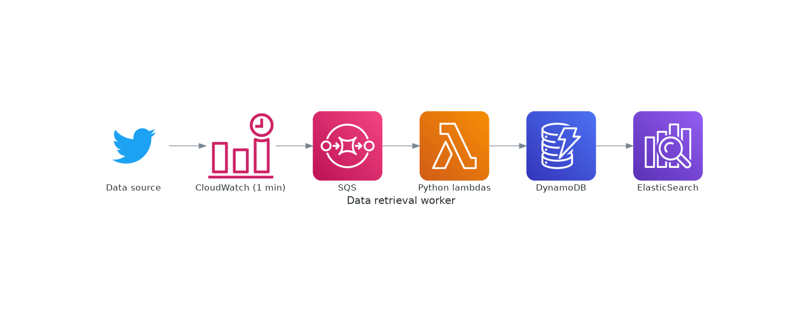
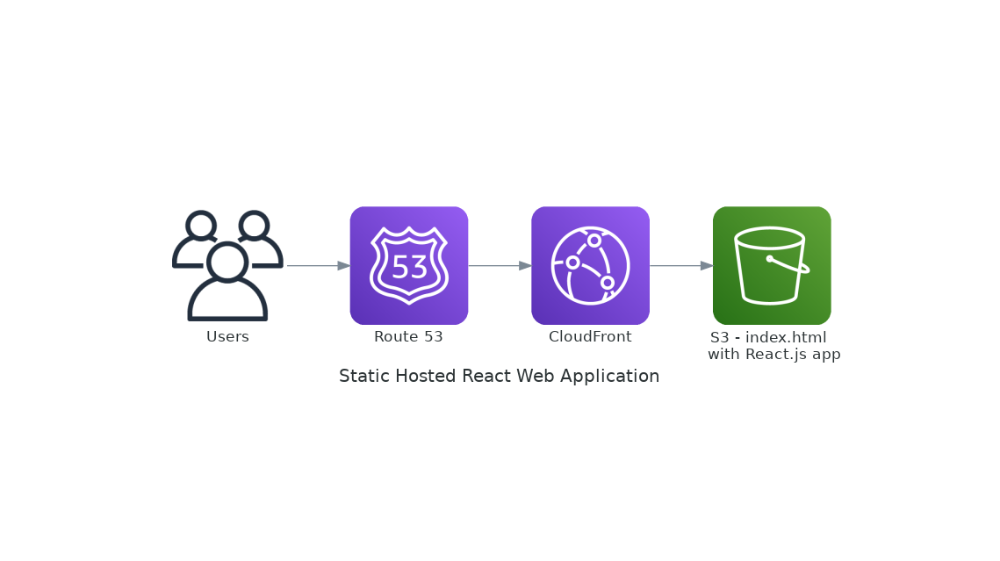
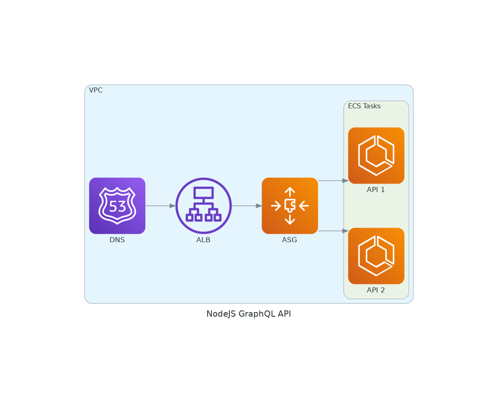

# FullstackFOMO architecture

Diagrams have been created using the diagrams as code framework in Python,
[diagrams][diagrams].

Python environment and packages are managed by [poetry][poetry]. More info on
getting this set up [below](#getting-started).

## Workers

There are several `AWS Lambda` worker functions that are run as **1min**
serverless cron jobs to ingest latest data from a source (e.g. `twitter`,
`reddit` etc.) and add write new data to the `DynamoDB`, which then streams
this data to be indexed in the `AWS ElasticSearch` cluster via
`DynamoDB streams`.



## Web

Web application is a client side rendered `React.js` application that is
statically hosted via a simple `Route53` + `CloudFront` + `S3` architecture.



## API

`Docker` to serve a `GraphQL API` developed with `node.js` + `TypeScript`.

> **NB:** Haven't decided whether to go ECS or Fargate yet. For now, assume
> `ECS` behind `ALB` + `ASG`.



# Getting Started

To get a local copy up and running follow these simple example steps.

## Prerequisites

- [Python3][python-install]
- [Poetry][poetry-install]
- [Graphviz][graphvis]

## Installation and Usage

```sh
# Create and enter python virtual environment
poetry shell

# Install dependencies
poetry install

# Run application to generate .png diagrams
poetry run python main.py
```

<!-- MARKDOWN LINKS -->

[python-install]: https://www.python.org/downloads/
[poetry]: https://python-poetry.org/docs/
[poetry-install]: https://github.com/python-poetry/poetry#installation
[diagrams]: https://github.com/mingrammer/diagrams
[graphvis]: https://graphviz.gitlab.io/download/
